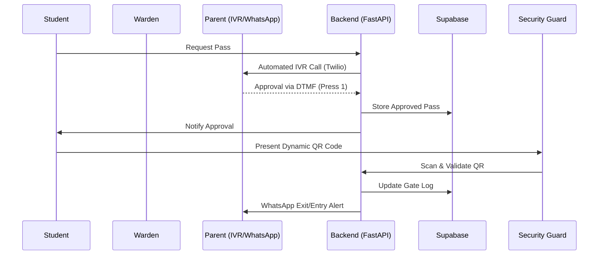

# 🛡️ E-GatePass: Digital Campus Security System

**E-GatePass** is a sophisticated, full-stack gatepass management solution designed to automate and secure student entry/exit workflows in educational institutions. Built with a premium Flutter frontend and a robust FastAPI backend, it eliminates manual register entries and enhances student safety through automated parent authorizations.

---

## ✨ Key Features

### 🔀 Multi-Role Ecosystem
- **Students**: Request passes, generate dynamic QR codes, and track pass history.
- **Wardens**: Approve/Reject requests with real-time dashboards and emergency management.
- **Security Guards**: Instant scanning of student QR codes with automated validation and gate log entry.

### 🤖 Intelligent Automation
- **IVR Authorization**: Automatic calls to parents (via Twilio) when a student requests a pass, requiring a DTMF input (Press 1 to Approve) for validation.
- **Dynamic QR Codes**: Time-sensitive, encrypted QR codes to prevent unauthorized sharing or reuse.
- **Real-time Notifications**: Immediate WhatsApp alerts to parents/guardians upon every entry and exit.

### 🎨 Premium User Experience
- **Modern UI/UX**: Royal Blue & Violet gradient theme with glassmorphism effects.
- **Animated Splash Screen**: Custom scanning shield animation for a secure first impression.
- **Smooth Navigation**: Role-based routing and seamless state management.

---

## 🛠️ Tech Stack

### Frontend
- **Framework**: [Flutter](https://flutter.dev/) (Dart)
- **Database Client**: `supabase_flutter`
- **Scanning**: `mobile_scanner`
- **QR Generation**: `qr_flutter`
- **Local Storage**: `shared_preferences`

### Backend
- **Framework**: [FastAPI](https://fastapi.tiangolo.com/) (Python)
- **Database**: [Supabase](https://supabase.com/) (PostgreSQL)
- **IVR Service**: Twilio SDK
- **Environment**: Ngrok for secure tunnelling (Development)
- **Authentication**: JWT-based secure sessions

---

## 🏗️ Architecture & Workflow



---

## 🚀 Getting Started

### Prerequisites
- Flutter SDK (`^3.10.7`)
- Python (`^3.9`)
- Supabase Project
- Twilio Account (for IVR)

### 1. Backend Setup
1. Navigate to the `backend` directory:
   ```bash
   cd backend
   ```
2. Create and activate a virtual environment:
   ```bash
   python -m venv .venv
   source .venv/bin/activate  # On Windows: .venv\Scripts\activate
   ```
3. Install dependencies:
   ```bash
   pip install -r requirements.txt
   ```
4. Configure `.env` (refer to `.env.example`):
   ```env
   SUPABASE_URL=your_url
   SUPABASE_ANON_KEY=your_key
   TWILIO_ACCOUNT_SID=your_sid
   TWILIO_AUTH_TOKEN=your_token
   NGROK_AUTHTOKEN=your_token
   ```
5. Run the server:
   ```bash
   python main.py
   ```

### 2. Frontend Setup
1. Navigate to the `frontend` directory:
   ```bash
   cd frontend
   ```
2. Fetch packages:
   ```bash
   flutter pub get
   ```
3. Configure `.env` in the `frontend` root:
   ```env
   SUPABASE_URL=your_url
   SUPABASE_ANON_KEY=your_key
   BACKEND_API_URL=http://your_backend_ip:5000/api
   ```
4. Run the app:
   ```bash
   flutter run
   ```

---

## 🔒 Security Measures
- **Row Level Security (RLS)**: Students can only view their own passes; Guards can only view current day logs.
- **Device ID Binding**: Passwords and sessions tied to specific hardware signatures to prevent spoofing.
- **Encrypted QR**: Dynamic data payload prevents replay attacks.

## 📄 License
Distributed under the MIT License. See `LICENSE` for more information.

---
*Developed with ❤️ for Academic Security.*
